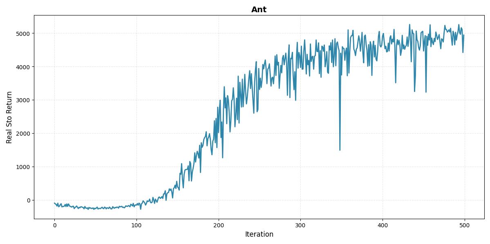
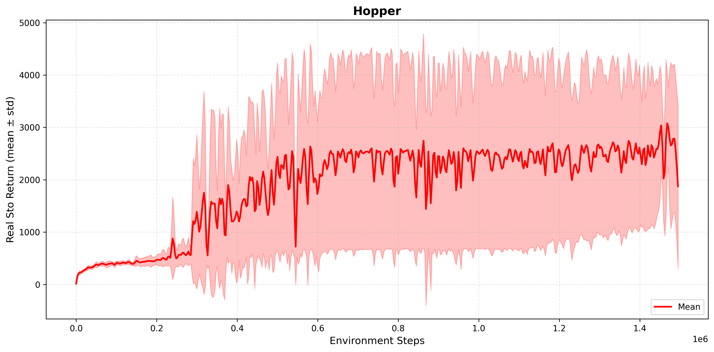

# f-IRL：基于f散度的逆强化学习

## 学习奖励函数
 

## 用学的奖励函数来训练智能体
<table>
  <tr>
    <td></td>
    <td></td>
    <td></td>
  </tr>
</table>

## 快速开始
运行时首先执行
```bash
export PYTHONPATH=${PWD}:$PYTHONPATH
```
1. 收集专家数据

```bash
python common/train_expert.py configs/samples/experts/hopper.yml
```

2. 学习奖励函数
```bash
python common/train_expert.py configs/samples/experts/hopper.yml
```

3. 用学得的奖励函数从头训练智能体
```bash
python common/train_optimal.py configs/sac_pretrained_reward_ant.yml
```
4. 绘制智能体学习时的真实奖励曲线

（1）绘制逆强化学习过程

```bash
python plot.py
```

（2）绘制智能体训练过程
```bash
python plot_real_sto_return_mean_std.py
```

5. 奖励函数迁移
```bash
python firl__vae/TraIRL.py configs/trairl_ant_transfer_multisource.yml
 ```
## Contact

**quxingyang@stu.ouc.edu.cn**.
